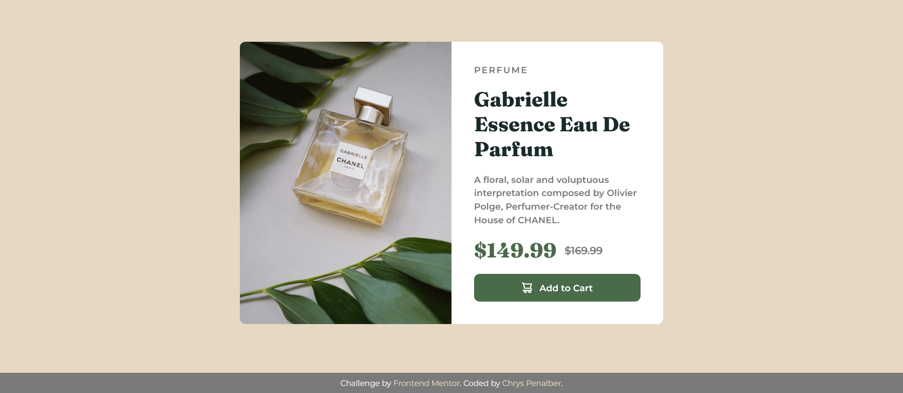

# Frontend Mentor - Product Preview Card Component Solution

This is a solution to the [Product Preview Card Component Challenge on Frontend Mentor](https://www.frontendmentor.io/challenges/). This challenge involves creating a responsive product card that displays product details, pricing, and a call-to-action button.

## Table of Contents

- [Overview](#overview)
  - [Screenshot](#screenshot)
  - [Links](#links)
- [My Process](#my-process)
  - [Built With](#built-with)
  - [What I Learned](#what-i-learned)
  - [Continued Development](#continued-development)
  - [Useful Resources](#useful-resources)
- [Author](#author)

## Overview

This project is a **product preview card component**, displaying an image, product details, and a call-to-action button. It is designed with a clean and modern aesthetic, ensuring responsiveness across different screen sizes. The challenge focused on CSS techniques for layout and styling, using **flexbox**, **CSS variables**, and **responsive design strategies**.

### Screenshot



### Links

- [Solution URL](https://github.com/chryspenalber/product-preview-card-component)
- [Live Site](https://chryspenalber.github.io/product-preview-card-component/)

## My Process

The development process followed a structured approach, including:

1. **Setting up semantic HTML** elements to ensure accessibility and SEO.
2. **Applying CSS styles**, focusing on responsiveness and aesthetic appeal.
3. **Implementing CSS variables** for easy theme adjustments.
4. **Ensuring mobile responsiveness**, adjusting layouts dynamically based on screen size.

### Built With

- Semantic **HTML5**
- **CSS3** (Custom properties, Flexbox, Responsive design)
- Google Fonts (**Fraunces** and **Montserrat**)

**Semantic HTML Tags Used:**

```html
<main>
<header>
<h1>
<h2>
<p>
<button>
<footer>
```

**CSS Features:**

- **CSS Variables:** Utilized for managing colors and consistency.
- **Flexbox Layout:** Used to align and center elements efficiently.
- **Responsive Design:** Implemented media queries and `clamp()` for dynamic styling.
- **Typography:**
  - "Fraunces" font for headings.
  - "Montserrat" font for descriptions and buttons.
- **Hover Effects:** Smooth button transition for improved UX.

### What I Learned

This project reinforced my knowledge of:

- The importance of **CSS variables** in maintaining a scalable design system.
- Using **flexbox** for structuring responsive components.
- Implementing **mobile-first design** principles.
- Enhancing **user interaction** with hover effects and button states.

### Continued Development

In future projects, I plan to:

- Improve **accessibility** by adding ARIA attributes.
- Experiment with **CSS Grid** for different layouts.
- Enhance **interactivity** with JavaScript for dynamic elements.

### Useful Resources

- [CSS Tricks - A Complete Guide to Flexbox](https://css-tricks.com/snippets/css/a-guide-to-flexbox/) - Helped with structuring the layout.
- [MDN Web Docs - CSS Custom Properties](https://developer.mozilla.org/en-US/docs/Web/CSS/Using_CSS_custom_properties) - Explained best practices for CSS variables.
- [Google Fonts](https://fonts.google.com/) - Used for typography choices.

## Author

- GitHub - [Chrys Penalber](https://github.com/chryspenalber)
- Frontend Mentor - [@chryspenalber](https://www.frontendmentor.io/profile/chryspenalber)
- LinkedIn - [Chrystiana Penalber](https://www.linkedin.com/in/chrystiana-penalber/)

